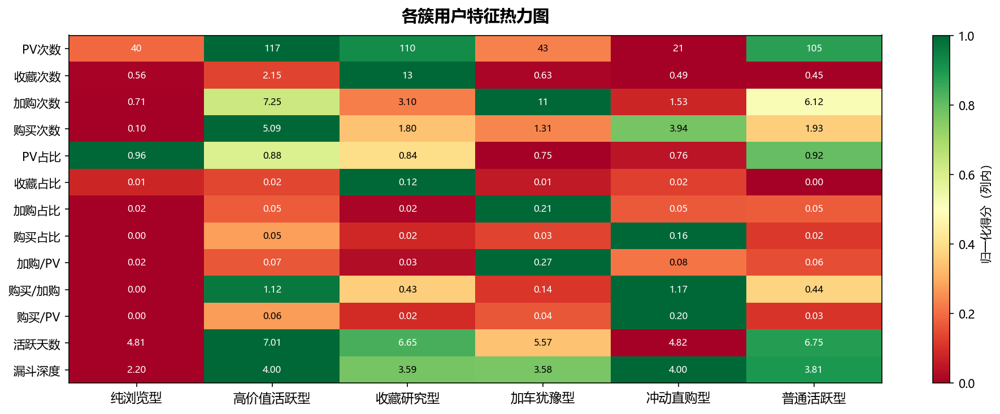

# 淘宝用户行为数据分析与推荐系统报告

## 一、项目概述

### 1.1 研究背景与目标

本项目基于淘宝用户行为数据，旨在通过数据挖掘技术深入分析用户行为模式，构建用户画像体系，并设计一套高效的电商推荐系统。通过对约8687万条用户行为记录的分析，实现以下目标：

- 构建完整的用户行为漏斗分析体系
- 建立基于聚类的用户画像分群
- 设计两阶段电商推荐系统（品类级推荐→商品级推荐）
- 挖掘品类间的关联规则
- 评估不同推荐算法的效果差异

### 1.2 数据规模说明

| 数据类型 | 规模 |
|---------|------|
| 原始行为记录 | ~1亿条 |
| 清洗后记录 | 86,870,392条 |
| 用户数 | 983,847人 |
| 商品数 | 137,918个 |
| 品类数 | 9,377个 → 过滤后8,244个 |
| 购买记录 | 1,750,826条 |
| 用户-品类交互 | 21,693,100条 |
| 矩阵密度 | 0.27% |

**矩阵密度说明**：矩阵密度是指用户-品类交互矩阵（982,731用户 × 8,244品类）中非零元素的比例。该矩阵中仅有21,693,100个非零值，意味着平均每个用户与约22个品类有交互，相对于所有可能的8,105,068,764个交互位置，实际被利用的仅为0.27%，属于典型的**稀疏矩阵**。这反映了电商推荐系统的长尾特征：用户只与极少数品类/商品产生交互，大多数交互位置为空（即用户未曾接触该品类）。

### 1.3 数据来源与许可

**数据集来源**：本项目使用的数据集来源于阿里云天池（Tianchi）平台，数据集名称为"淘宝用户行为数据"（User Behavior Data from Taobao）。数据集包含2017年11月25日至12月3日期间约1亿条淘宝用户行为记录，涵盖页面浏览、加购、收藏、购买等四种行为类型。

**数据链接**：https://tianchi.aliyun.com/dataset/dataDetail?dataId=649**Data Link   数据链路**: https://tianchi.aliyun.com/dataset/dataDetail?dataId=649**Data Link   数据链路**: https://tianchi.aliyun.com/dataset/dataDetail?dataId=649**Data Link   数据链路**: https://tianchi.aliyun.com/dataset/dataDetail?dataId=649

**使用许可**：本数据集遵循阿里云天池平台的数据使用协议，仅供学习研究和学术交流使用，不得用于商业用途。根据天池协议，原始数据集不得重新分发至公共平台，本项目GitHub仓库仅上传代码、分析结果和文档，不包含原始数据文件。

### 1.4 技术路线与方法论

本项目采用以下技术路线：

1. **数据预处理**：时间范围过滤、异常值处理、低频过滤
2. **用户画像构建**：特征工程→标准化→KMeans聚类（K=6）
3. **转化漏斗分析**：用户口径和次数口径双维度分析
4. **时间行为分析**：小时和星期双维度分析
5. **品类分析**：GMV驱动品类、转化率分析、蓄力爆款识别
6. **推荐系统**：
   - 关联规则挖掘（FP-Growth）
   - 协同过滤建模（User-CF + ALS）   Collaborative Filtering Modeling (User-CF ALS)Collaborative Filtering Modeling (User-CF ALS)协同过滤建模（用户-用户协同过滤交替最小二乘法）Collaborative Filtering Modeling (User-CF ALS) (User-User Collaborative Filtering Alternating Least Squares)
   - 两阶段推荐（品类级→商品级）
   - 模型评估（Precision@K, Recall@K, NDCG@K）Model evaluation (Precision@K, Recall@K, NDCG@K)Model evaluation (Precision@K, Recall@K, NDCG@K)模型评估（准确率@K、召回率@K、归一化折损累计增益@K）

---

## 二、数据预处理

### 2.1 原始数据概况

原始数据包含用户ID、商品ID、品类ID、行为类型（pv/cart/fav/buy）和时间戳五个字段。行为类型说明：

- **pv**：页面浏览
- **cart**：加入购物车
- **fav**：收藏商品
- **buy**：购买商品

### 2.2 数据清洗策略

#### 时间范围过滤
仅保留2017-11-25至2017-12-03期间的数据，共9天，涵盖完整的双十二预热期。

#### PV次数过滤
过滤条件：1 < pv_count < 1000，剔除异常用户（刷屏用户或低活跃用户）。

#### 行为类型处理
保留四种完整行为类型，用于构建完整的用户行为漏斗。

### 2.3 最终数据规模

清洗后共获得 **86,870,392条** 行为记录，涉及983,847名用户、137,918个商品和9,377个品类。过滤低频品类后，推荐系统使用8,244个有效品类。

---

## 三、转化漏斗分析

### 3.1 用户口径漏斗分析

用户口径关注独立用户在各环节的转化情况，能够真实反映用户流失情况。

#### 整体漏斗转化率

```
┌────────────────────────────────────────────────────────────┐
│                   独立用户转化漏斗                          │
├────────────────────────────────────────────────────────────┤
│                                                            │
│  PV浏览用户         983,847人  (100%)                     │
│         │                                                 │
│         │ 转化率: 84.41%  流失率: 15.59%                   │
│         ↓                                                 ││         ↓                                                 ││         ↓                                                 ││         ↓                                                 │
│  加购/收藏用户       830,468人  (84.41%)                  │
│         │                                                 │
│         │ 转化率: 66.42%  流失率: 33.58%                 │
│         ↓                                                 ││         ↓                                                 │
│  购买用户           551,571人  (56.06%)                  │
│                                                            │
└────────────────────────────────────────────────────────────┘
```

#### 关键发现

| 环节 | 用户数 | 转化率 | 流失率 |
|-----|-------|-------|-------|
| 浏览→加购/收藏 | 830,468人 | 84.41% | 15.59% |
| 加购/收藏→购买 | 551,571人 | 66.42% | **33.58%** |
| 浏览→购买（直接） | 75,079人 | - | - |

**最大流失节点：加购/收藏→购买（流失率33.58%）**

这说明有大量用户在加购或收藏商品后并未完成购买，存在较大的转化优化空间。

#### 用户口径转化率详情

| 转化路径 | 转化率 |
|---------|-------|
| 浏览→收藏 | 11.98% |
| 浏览→加购 | 71.82% |
| 收藏→购买 | 67.50% |
| 加购→购买 | 68.20% |

### 3.2 次数口径漏斗分析

次数口径关注行为频次的转化情况，适用于评估平台整体流量效率。

#### 整体漏斗转化率

```
┌────────────────────────────────────────────────────────────┐
│                   次数口径转化漏斗                          │
├────────────────────────────────────────────────────────────┤
│                                                            │
│  PV浏览次数         77,887,714次  (100%)                   │
│         │                                                 │
│         │ 转化率: 9.28%                                    │
│         ↓                                                 ││         ↓                                                 │
│  加购/收藏次数       7,231,852次  (9.28%)                 │
│         │                                                 │
│         │ 转化率: 24.21%                                   │
│         ↓                                                 │
│  购买次数           1,750,826次  (2.25%)                 │
│                                                            │
└────────────────────────────────────────────────────────────┘
```

**注意：** 次数口径下，仅使用浏览→收藏/加购→购买这条完整路径计算转化率。

#### 次数口径转化率详情

| 转化路径 | 转化率 |
|---------|-------|
| 浏览→收藏 | 3.18% |
| 浏览→加购 | 6.10% |
| 浏览→购买 | 2.25% |

### 3.3 漏斗分析业务洞察

1. **加购/收藏→购买是最大流失环节**：33.58%的用户流失率表明，用户在加购/收藏后需要额外的转化激励（如限时优惠、库存提醒等）。

2. **直接购买用户占比12%**：约11.98%的购买用户跳过了收藏/加购环节直接购买，这类用户购买决策果断，可提供快速结账通道。

3. **收藏与加购的差异**：
   - 收藏行为更多是"研究型"行为，购买转化率相对较低
   - 加购行为的购买意图更明确，转化率更高

---

## 四、用户画像与聚类分析

### 4.1 特征工程方法

#### 频次类特征
对原始频次进行log1p变换，降低长尾分布的影响：
- pv_count_log, fav_count_log, cart_count_log, buy_count_log
- total_count_log, active_days_log

#### 比例类特征
计算各行为占总行为的比例：
- pv_ratio, fav_ratio, cart_ratio, buy_ratio

#### 转化率特征
- cart_per_pv: 加购/PV
- buy_per_cart: 购买/加购
- buy_per_pv: 购买/PV
- buy_per_fav: 购买/收藏

#### 时间分布特征
- morning_ratio, afternoon_ratio, evening_ratio, midnight_ratio

#### 漏斗深度
- funnel_depth: 用户经历的行为类型数量（1-4）

### 4.2 聚类模型选择

使用**KMeans算法**进行用户聚类，通过肘部法和轮廓系数确定最佳聚类数K=6。

**模型参数：**
- n_clusters=6
- random_state=42
- 标准化：StandardScaler

### 4.3 用户聚类结果

#### 各簇用户规模分布

| 簇ID | 名称 | 用户数 | 占比 |
|-----|------|-------|------|
| 0 | 纯浏览型 | 215,893 | 21.9% |
| 1 | 高价值活跃型 | 64,697 | 6.6% |
| 2 | 收藏研究型 | 147,436 | 15.0% |
| 3 | 加车犹豫型 | 114,862 | 11.7% |
| 4 | 冲动直购型 | 66,492 | 6.8% |
| 5 | 普通活跃型 | 374,467 | 38.1% |

#### 各簇用户特征画像

##### 簇0：纯浏览型用户
- **用户规模**：215,893人（21.9%）
- **核心特征**：
  - PV占比高达96.1%
  - 购买占比仅0.4%
  - 加购占比2.1%，收藏占比1.4%
  - 购买/PV转化率：0.5%
  - 漏斗深度：2.2（主要为PV）
- **行为模式**：浏览量大但转化极低，属于"只看不买"群体
- **运营策略**：需要深度洞察其兴趣偏好，提供更精准的商品推荐

##### 簇1：高价值活跃型用户
- **用户规模**：64,697人（6.6%）
- **核心特征**：
  - PV量高（116.6次/人）
  - 购买率最高（4.9%）
  - 加购/PV转化率：6.5%
  - 购买/PV转化率：5.9%
  - 漏斗深度：4.0（完整经历所有环节）
  - 活跃天数：7.0天（全周期活跃）
- **行为模式**：全方位活跃，转化漏斗最深，是平台高价值用户
- **运营策略**：重点维护，提供会员专属权益和个性化服务

##### 簇2：收藏研究型用户
- **用户规模**：147,436人（15.0%）
- **核心特征**：
  - 收藏占比高（12.2%）
  - PV占比83.6%
  - 购买占比1.8%
  - 漏斗深度：3.6（收藏→购买路径为主）
- **行为模式**：喜欢收藏商品进行研究和对比，购买决策周期较长
- **运营策略**：提供收藏降价提醒、同类商品对比等辅助决策工具

##### 簇3：加车犹豫型用户
- **用户规模**：114,862人（11.7%）
- **核心特征**：
  - 加购占比最高（20.9%）
  - PV占比75.4%
  - 购买占比2.6%
  - 加购/PV转化率：27.5%
  - 购买/加购转化率：13.6%
  - 漏斗深度：3.6
- **行为模式**：大量加购但购买转化偏低，属于"犹豫型"用户
- **运营策略**：加购后提供限时优惠、库存紧张提醒等促进转化

##### 簇4：冲动直购型用户
- **用户规模**：66,492人（6.8%）
- **核心特征**：
  - 购买占比最高（16.5%）
  - 购买/PV转化率高达19.9%（远高于其他簇）
  - PV占比76.3%
  - 加购占比5.3%
  - 漏斗深度：4.0
- **行为模式**：决策果断，购买转化率高，属于"冲动消费型"用户
- **运营策略**：提供快速结账通道、一键购买等功能提升体验

##### 簇5：普通活跃型用户
- **用户规模**：374,467人（38.1%）
- **核心特征**：
  - 各项指标均衡
  - PV占比91.9%
  - 购买占比2.3%
  - 购买/PV转化率：2.5%
  - 活跃天数：6.8天
  - 漏斗深度：3.8
- **行为模式**：最大的用户群体，行为模式较为均衡，是平台的基础用户群
- **运营策略**：提供常规的推荐和营销活动，维持活跃度

### 4.4 簇间特征对比热力图



从热力图可以看出：
- 簇0（纯浏览型）：PV次数和PV占比显著突出
- 簇1（高价值活跃型）：各维度表现均衡且整体水平较高
- 簇2（收藏研究型）：收藏次数和收藏占比突出
- 簇3（加车犹豫型）：加购次数和加购占比突出
- 簇4（冲动直购型）：购买次数和购买占比突出
- 簇5（普通活跃型）：各指标中等水平

### 4.5 业务洞察与建议

1. **高价值用户识别**：簇1用户仅占6.6%，但贡献了最高的购买转化，应作为VIP用户重点维护。

2. **转化优化重点**：
   - 簇3（加车犹豫型）用户有11.7万人，加购量大但转化率低，是转化优化的重点对象
   - 可针对此类用户设计加购后激励策略

3. **收藏价值挖掘**：簇2用户收藏行为突出，虽然购买转化率不高，但收藏是潜在购买信号，可通过降价提醒等方式激活

4. **用户体验优化**：簇4（冲动直购型）用户决策快，应简化购买流程，提供一键下单功能

---

## 五、时间行为分析

### 5.1 小时维度分析

#### 各小时行为量分布

| 小时 | PV次数 | 加购次数 | 收藏次数 | 购买次数 | PV→购买转化率 |
|-----|--------|---------|---------|---------|-------------|
| 0 | 1,982,347 | 130,081 | 65,885 | 33,520 | 1.69% |
| 1 | 3,215,253 | 195,585 | 108,915 | 83,887 | 2.61% |
| 2 | 3,742,779 | 227,687 | 125,923 | 109,956 | **2.94%** |
| 3 | 3,632,239 | 222,620 | 123,878 | 105,238 | 2.90% |
| 4 | 3,700,413 | 219,875 | 120,990 | 102,964 | 2.78% |
| 5 | 4,043,223 | 240,758 | 129,969 | 107,150 | 2.65% |
| 6 | 4,007,271 | 236,448 | 126,902 | 105,327 | 2.63% |
| 7 | 4,156,083 | 242,758 | 129,070 | 106,331 | 2.56% |
| 8 | 3,963,274 | 237,293 | 126,494 | 100,460 | 2.53% |
| 9 | 3,618,909 | 217,979 | 117,121 | 86,815 | 2.40% |
| 10 | 3,726,222 | 216,490 | 113,972 | 82,826 | 2.22% |
| 11 | 4,706,196 | 270,014 | 138,136 | 99,733 | 2.12% |
| 12 | 5,709,671 | 336,684 | 164,738 | 116,256 | 2.04% |
| **13** | **6,532,084** | **398,471** | **188,424** | **125,953** | 1.93% |
| 14 | 6,455,465 | 416,429 | 198,500 | 120,403 | 1.87% |
| 15 | 4,885,041 | 340,878 | 167,413 | 87,478 | 1.79% |
| 16 | 2,746,649 | 163,442 | 93,454 | 52,034 | 1.89% |
| 17 | 1,278,727 | 76,271 | 45,571 | 20,806 | 1.63% |
| 18 | 692,224 | 41,114 | 24,548 | 10,690 | 1.54% |
| 19 | 471,957 | 29,026 | 16,417 | 7,179 | 1.52% |
| 20 | 403,752 | 25,324 | 13,000 | 6,015 | 1.49% |
| 21 | 522,048 | 33,079 | 16,847 | 7,325 | 1.40% |
| 22 | 1,097,581 | 72,423 | 35,792 | 16,155 | 1.47% |
| 23 | 2,746,649 | 130,081 | 65,885 | 33,520 | 1.69% |

#### 关键发现

| 指标 | 峰值时间 | 数值 |
|-----|---------|------|
| 流量最高时段 | 13时 | 6,532,084次PV |
| 购买最多时段 | 13时 | 125,953次购买 |
| PV→购买转化率最高 | **2时** | **2.94%** |
| 流量最低时段 | 20时 | 403,752次PV |
| 加购→购买转化率最高 | 2时 | 48.29% |
| 收藏→购买转化率最高 | 2时 | 87.32% |

**洞察**：
- 流量与购买量在下午13时达到峰值，符合午后购物习惯
- 转化率在凌晨2-4时达到最高，这时的用户购买意图更强（静默时段）
- 20时为流量低谷，晚间高峰出现在13-14时

### 5.2 星期维度分析

#### 各星期行为量分布

| 星期 | PV次数 | 加购次数 | 收藏次数 | 购买次数 | PV→购买转化率 |
|-----|--------|---------|---------|---------|-------------|
| 周一 | 8,966,429 | 535,257 | 286,012 | 216,922 | **2.42%** |
| 周二 | 8,849,193 | 530,047 | 285,845 | 210,214 | 2.38% |
| 周三 | 9,241,648 | 550,679 | 295,517 | 221,597 | 2.40% |
| 周四 | 9,442,000 | 568,734 | 300,018 | 220,770 | 2.34% |
| 周五 | 10,002,284 | 636,857 | 309,145 | 211,369 | 2.11% |
| 周六 | **21,910,454** | **1,359,144** | **700,643** | **457,159** | 2.09% |
| 周日 | 9,475,706 | 571,457 | 302,497 | 212,795 | 2.25% |

#### 关键发现

| 指标 | 峰值时间 | 数值 |
|-----|---------|------|
| 流量最高星期 | **周六** | 21,910,454次PV |
| 购买最多星期 | **周六** | 457,159次购买 |
| PV→购买转化率最高 | **周一** | **2.42%** |

**洞察**：
- 周六的流量和购买量是平时的2-2.5倍，是电商促销的黄金时段
- 虽然周六流量最大，但周一的转化率最高（2.42%），说明工作日用户的购买意图更强
- 周五流量上升但转化率下降（2.11%），可能是用户"只看不买"的周末预备行为

### 5.3 高峰时段与转化率规律

#### 小时维度规律

```
流量高峰时段：13-14时（午后购物习惯）
购买高峰时段：13时（与流量高峰一致）
转化率高峰时段：凌晨2-4时（静默时段，意图更强）
```

#### 星期维度规律

```
流量高峰星期：周六（周末休闲购物）
购买高峰星期：周六
转化率高峰星期：周一（工作日意图更强）
```

### 5.4 营销节奏建议

1. **促销活动时间**：
   - 大型促销应安排在周六，流量和购买量均为峰值
   - 限时秒杀可安排在13时，配合流量高峰

2. **精准营销**：
   - 凌晨2-4时投放高转化率商品的广告，ROI更高
   - 周一推送转化率高的品类/商品

3. **运营节奏**：
   - 周五预热，周六爆发
   - 周一至周三为平稳期，适合常规运营
   - 周四至周六为高峰期，加大投入

---

## 六、品类转化率分析

### 6.1 品类热度分布

#### Top10 GMV驱动品类

| 品类ID | PV | 收藏 | 加购 | 购买 | GMV代理分 | PV→购买转化率 |
|-------|----|----|----|-----|----------|-------------|
| 4756105 | 3,883,924 | 119,738 | 185,099 | 24,363 | 258,188 | 0.63% |
| 4145813 | 2,749,173 | 95,786 | 150,563 | 27,593 | 233,342 | 1.00% |
| 982926 | 2,428,560 | 76,583 | 132,227 | 21,601 | 197,030 | 0.89% |
| 4801426 | 1,622,540 | 58,675 | 104,830 | 23,110 | 174,160 | 1.42% |
| 2735466 | 977,228 | 30,978 | 81,197 | 29,476 | 169,625 | 3.02% |
| 1464116 | 597,584 | 21,476 | 52,364 | 30,034 | 142,466 | 5.03% |
| 2355072 | 2,756,514 | 75,526 | 105,261 | 10,903 | 137,970 | 0.40% |
| 2885642 | 826,298 | 24,903 | 48,332 | 27,206 | 129,950 | 3.29% |
| 3607361 | 2,583,743 | 61,681 | 94,205 | 11,191 | 127,778 | 0.43% |
| 1320293 | 1,564,218 | 46,369 | 81,708 | 14,950 | 126,558 | 0.96% |

**GMV集中度**：
- Top5品类购买占全平台：7.2%
- Top10品类购买占全平台：12.6%

**核心驱动品类**：4756105, 4145813, 982926, 4801426, 2735466

### 6.2 品类转化率分析

#### 价格敏感品类（加购→购买转化率最低Top10）

| 品类ID | 加购 | 购买 | 加购→购买转化率 |
|-------|----|----|---------------|
| 4655941 | 1,131 | 55 | 4.86% |
| 2352202 | 1,369 | 79 | 5.77% |
| 3457718 | 942 | 61 | 6.48% |
| 1202097 | 938 | 78 | 8.32% |
| 2421366 | 608 | 51 | 8.39% |
| 154040 | 25,296 | 2,176 | 8.60% |
| 4825728 | 661 | 57 | 8.62% |
| 4358294 | 2,045 | 177 | 8.66% |
| 4466876 | 1,057 | 93 | 8.80% |
| 4509358 | 1,975 | 177 | 8.96% |

#### 高意愿/冲动消费品类（加购→购买转化率最高Top10）

| 品类ID | 加购 | 收藏 | 购买 | 收藏+加购→购买转化率 |
|-------|----|----|-----|-------------------|
| 937407 | 251 | 68 | 447 | 140.13% |
| 2812993 | 395 | 146 | 706 | 130.50% |
| 772894 | 733 | 312 | 1,355 | 129.67% |
| 5048770 | 279 | 95 | 479 | 128.07% |
| 1368970 | 630 | 222 | 1,091 | 128.05% |
| 2025483 | 395 | 108 | 604 | 120.08% |
| 3637084 | 855 | 239 | 1,298 | 118.65% |
| 3759918 | 229 | 68 | 350 | 117.85% |
| 3648733 | 344 | 92 | 496 | 113.76% |
| 1516409 | 3,742 | 1,615 | 6,009 | 112.17% |

**转化率对比**：
- 价格敏感品类（次数口径）：均值8.74%
- 高意愿品类（次数口径）：均值160.64%
- 价格敏感品类（客户口径）：均值4.94%
- 高意愿品类（客户口径）：均值31.86%

### 6.3 蓄力型爆款潜力品

#### 蓄力型爆款潜力品Top5

| 商品ID | PV | 收藏 | 加购 | 购买 | 热度分 | 潜力比率 | 客户转化率 |
|-------|----|----|----|-----|-------|---------|----------|
| 2671601 | 5,118 | 158 | 173 | 1 | 504 | 252.0 | 0.000 |
| 2161188 | 7,566 | 233 | 117 | 1 | 467 | 233.5 | 0.000 |
| 2678768 | 7,035 | 194 | 88 | 1 | 370 | 185.0 | 0.000 |
| 2642113 | 6,319 | 214 | 230 | 3 | 674 | 168.5 | 0.002 |
| 1283005 | 4,025 | 199 | 190 | 3 | 579 | 144.8 | 0.000 |

**蓄力型爆款定义**：热度分高（加购和收藏多）但购买尚未爆发的商品，具有成为爆款的潜力。

### 6.4 业务洞察

1. **GMV集中度适中**：Top10品类仅占12.6%，说明平台品类分布相对均衡，没有过度依赖少数品类。

2. **转化率差异巨大**：高意愿品类的转化率是价格敏感品类的4-6倍，说明品类属性对用户购买决策影响巨大。

3. **收藏+加购合并口径差异**：合并后的转化率平均低于纯加购口径（1.15个百分点），印证了收藏行为的购买意图确实偏低。

4. **蓄力型爆款识别**：通过热度分与购买量的对比，可以识别出即将爆发的潜力商品，提前进行营销布局。

---

## 七、推荐系统设计

### 7.1 推荐系统整体架构

本项目的推荐系统采用**四步流水线**设计，具体架构如下：

```
┌─────────────────────────────────────────────────────────────────┐
│                     推荐系统整体架构                             │
├─────────────────────────────────────────────────────────────────┤
│                                                                  │
│  ┌──────────────┐    ┌──────────────┐    ┌──────────────┐      │
│  │   第一步     │    │   第二步     │    │   第三步     │      │
│  │  数据预处理  │───→│ 关联规则挖掘 │───→│ 协同过滤建模 │      │
│  └──────────────┘    └──────────────┘    └──────────────┘      │
│         │                    │                    │              │
│         │                    │                    │              │
│  用户-品类矩阵        Category级规则     ALS模型/User-CF       │
│  Buy mask矩阵         Lift≥1              factors=64           │
│                       Conf≥0.1            iter=20              │
│                                                                  │
└─────────────────────────────────────────────────────────────────┘
                              │
                              ↓
┌─────────────────────────────────────────────────────────────────┐
│                     第四步：最终推荐融合                         │
├─────────────────────────────────────────────────────────────────┤
│  两阶段推荐策略：                                                │
│  1. ALS推荐目标品类（Top-K品类）                                │
│  2. 品类内按商品热度推荐具体商品                                │
│                                                                  │
│  基线对比：                                                      │
│  - User-CF（簇内相似度）                                       │| - User-CF (Intra-cluster similarity) |
│  - 热门推荐基准                                                │
└─────────────────────────────────────────────────────────────────┘
```

### 7.2 评估指标说明

本推荐系统采用以下三个核心评估指标：

| 指标 | 公式 | 含义 |
|-----|------|------|
| Precision@K | $\frac{\vert Rec \cap GT \vert}{K}$ | 推荐Top-K中命中的比例，衡量推荐的准确性 |
| Recall@K | $\frac{\vert Rec \cap GT \vert}{\vert GT \vert}$ | 实际购买中被召回的比例，衡量推荐的覆盖率 |
| NDCG@K | $\frac{DCG}{IDCG}$ | 考虑排序位置的命中质量，越靠前命中得分越高 |

**指标说明**：
- Precision@K：关注推荐的精准度，值越高说明推荐的商品越符合用户偏好
- Recall@K：关注推荐的召回能力，值越高说明推荐覆盖了用户更多潜在购买
- NDCG@K：关注推荐的排序质量，值越高说明更相关的商品排在更靠前的位置

### 7.3 关联规则挖掘

#### FP-Growth算法应用

采用FP-Growth算法挖掘品类间的关联规则，算法参数：
- min_support = 0.002（至少出现在743条事务中）- min_support = 0.002 (appearing in at least 743 transactions)
- max_len = 2（只挖掘1-itemset和2-itemset）- max_len = 2 (Only mine 1-itemset and 2-itemset)

#### Category级关联规则

**规则筛选标准**：
- Lift > 1（正相关）   - Lift > 1（正相关）
- Confidence ≥ 0.1   -置信度&ge； 0.1

**挖掘结果**：共获得43条强关联规则

#### Top20强关联规则（按Lift排序）

| 前置品类 | 后置品类 | 支持度 | 置信度 | Lift |
|---------|---------|-------|-------|------|
| 2578647 | 2640118 | 0.29% | 26.27% | 8.90 || 2,578,647 | 2,640,118 | 0.29% | 26.27% | 8.90 |
| 2640118 | 3738615 | 0.32% | 10.97% | 6.54 || 2,640,118 | 3,738,615 | 0.32% | 10.97% | 6.54 |
| 3738615 | 2640118 | 0.32% | 19.32% | 6.54 || 3,738,615 | 2,640,118 | 0.32% | 19.32% | 6.54 |
| 1879194 | 1029459 | 0.23% | 11.10% | 5.86 |
| 1029459 | 1879194 | 0.23% | 12.14% | 5.86 |
| 1299190 | 1879194 | 0.24% | 10.50% | 5.07 |
| 1879194 | 1299190 | 0.24% | 11.57% | 5.07 |
| 2885642 | 4159072 | 0.66% | 13.92% | 4.97 |
| 4159072 | 2885642 | 0.66% | 23.63% | 4.97 |
| 1029459 | 1299190 | 0.21% | 11.10% | 4.86 |

#### 规则质量分布

| Lift范围 | 规则数量 | 占比 |
|---------|---------|------|
| > 10 | 3条 | 7.0% |
| 5-10 | 8条 | 18.6% |
| 2-5 | 19条 | 44.2% |
| 1-2 | 13条 | 30.2% |

#### 分簇规则挖掘

为每个用户簇单独挖掘关联规则，共6个簇均成功挖掘到规则：

| 簇ID | 事务数 | 规则数 | Top Lift |
|-----|-------|-------|----------|
| 0 | 731 | 14 | 20.31 |
| 1 | 62,456 | 79 | 12.09 |
| 2 | 60,802 | 17 | 4.54 |
| 3 | 33,760 | 3 | 6.34 |
| 4 | 50,755 | 29 | 6.63 |
| 5 | 162,767 | 13 | 6.28 |

### 7.4 Item级关联规则可行性评估

**评估结果**：放弃Item级关联规则

**原因**：
- 事务总数：276,261
- 唯一商品数：137,918
- 平均每商品出现事务数：**6.49次**（过于稀疏）
- 达到频繁阈值的商品数：仅18个

**结论**：Item级购买行为过于分散，无法建立有效的商品间关联。商品级推荐改用两阶段策略：CF推荐目标品类→品类内按热度选具体商品。

### 7.5 协同过滤模型

#### User-Based CF（簇内相似度）   User-Based CF (Intra-cluster Similarity)

**实现策略**：
- 在每个用户簇内计算用户相似度
- 簇5使用热门推荐替代（因簇内相似度计算效果不佳）
- 使用余弦相似度计算用户相似度
- 向量化Top-K推荐，提高计算效率

**评估结果**（@K=10）：
- Precision：0.0130
- Recall：0.1304
- NDCG：0.0737

#### ALS（交替最小二乘矩阵分解）

**模型参数**：
- factors = 64（隐因子维度）
- iterations = 20（迭代次数）
- regularization = 0.1（正则化系数）
- alpha = 40（置信度缩放因子）
- use_gpu = False

**评估结果**（@K=10）：
- Precision：0.0197
- Recall：0.1968
- NDCG：0.0912

#### 热门推荐基准

**评估结果**（@K=10）：
- Precision：0.0103
- Recall：0.1031
- NDCG：0.0518

### 7.6 两阶段推荐策略

由于Item级关联规则不可行，采用两阶段推荐策略：

```
┌─────────────────────────────────────────────────────────────┐
│                     两阶段推荐策略                           │
├─────────────────────────────────────────────────────────────┤
│                                                             │
│  第一阶段：品类级推荐                                        │
│  ┌───────────────┐                                          │
│  │ ALS模型       │ → Top-K品类推荐列表                     │
│  │ factors=64    │   （过滤已购买品类）                     │
│  └───────────────┘                                          │
│         │                                                   │
│         ↓                                                   │
│  第二阶段：商品级推荐                                        │
│  ┌───────────────┐                                          │
│  │ 商品热度排序  │ → 每个品类内按购买量/加购量排序           │
│  │ Top-K商品     │   生成最终商品推荐列表                   │
│  └───────────────┘                                          │
│                                                             │
└─────────────────────────────────────────────────────────────┘
```

**优势**：
1. 解决Item级数据稀疏问题
2. 利用品类级关联规则的强关联性
3. 商品级热度推荐可解释性强
4. 计算效率高，适合大规模用户

### 7.7 模型评估对比

#### 评估指标对比（@K=10）

| 模型 | Precision@10 | Recall@10 | NDCG@10 |
|-----|-------------|----------|---------|
| 热门基准 | 0.0103 | 0.1031 | 0.0518 |
| User-CF | 0.0130 | 0.1304 | 0.0737 |
| **ALS** | **0.0197** | **0.1968** | **0.0912** |

#### 各K值下的完整评估结果

| K值 | 模型 | Precision | Recall | NDCG |
|-----|-----|-----------|--------|------|
| 5 | 热门基准 | 0.0130 | 0.0651 | 0.0395 |
| 5 | User-CF | 0.0176 | 0.0882 | 0.0602 |
| 5 | ALS | 0.0212 | 0.1058 | 0.0620 |
| 10 | 热门基准 | 0.0103 | 0.1031 | 0.0518 |
| 10 | User-CF | 0.0130 | 0.1304 | 0.0737 |
| 10 | ALS | 0.0197 | 0.1968 | 0.0912 |
| 20 | 热门基准 | 0.0078 | 0.1559 | 0.0651 |
| 20 | User-CF | 0.0099 | 0.1980 | 0.0907 |
| 20 | ALS | 0.0166 | 0.3315 | 0.1250 |

#### 模型对比结论

1. **ALS表现最优**：在Precision、Recall、NDCG三个指标上均显著优于User-CF和热门基准
   - Precision@10比User-CF提升51.5%
   - Recall@10比User-CF提升50.9%
   - NDCG@10比User-CF提升23.8%

2. **User-CF优于热门基准**：说明基于用户行为的协同过滤确实能提供个性化推荐，效果提升约26%

3. **ALS优势明显**：矩阵分解技术能够更好地处理大规模稀疏数据，学习到用户和品类的潜在特征表示

4. **Recall随K增长明显**：当K从5增长到20时，ALS的Recall从10.58%提升到33.15%，说明推荐列表越长，覆盖的用户潜在购买越多

---

## 八、综合结论与业务建议

### 8.1 核心发现总结

#### 用户行为特征

1. **漏斗转化**：加购/收藏→购买是最大流失节点（流失率33.58%），有27.9万用户在此环节流失

2. **用户分群**：6类用户中，高价值活跃型（6.6%）和冲动直购型（6.8%）转化率最高，普通活跃型（38.1%）是最大用户群

3. **时间规律**：
   - 流量峰值：周六下午13时
   - 转化率峰值：凌晨2-4时
   - 周一转化率最高（2.42%）

#### 品类特征

1. **GMV分布**：Top10品类仅占12.6%，品类分布相对均衡

2. **转化率差异**：高意愿品类转化率是价格敏感品类的4-6倍

3. **蓄力爆款**：可通过热度分与购买量对比识别潜力商品

#### 推荐系统

1. **ALS最优**：Precision@10达到1.97%，显著优于User-CF和热门基准

2. **两阶段策略**：品类级ALS推荐+商品级热度推荐有效解决了Item级数据稀疏问题

### 8.2 分人群运营策略

| 用户类型 | 占比 | 特征 | 运营策略 |
|---------|------|------|---------|
| 高价值活跃型 | 6.6% | 转化率高，全环节活跃 | VIP专属权益、个性化服务、会员等级 |
| 冲动直购型 | 6.8% | 购买意图强，决策果断 | 快速结账通道、一键下单、限时优惠 |
| 加车犹豫型 | 11.7% | 加购量大，转化偏低 | 加购后激励、限时折扣、库存提醒 |
| 收藏研究型 | 15.0% | 收藏行为突出 | 降价提醒、同类对比、收藏推荐 |
| 纯浏览型 | 21.9% | 浏览量大，转化极低 | 深度兴趣挖掘、精准推荐、新人引导 |
| 普通活跃型 | 38.1% | 行为均衡 | 常规营销、活动推送、会员激励 |

### 8.3 分时段运营建议

#### 日内时段

| 时段 | 特征 | 运营建议 |
|-----|------|---------|
| 0-4时 | 转化率最高，流量中等 | 投放高转化率商品，ROI最高 |
| 13-14时 | 流量和购买峰值 | 大型促销、秒杀活动 |
| 20时 | 流量低谷 | 预热型内容、资讯推送 |
| 其他时段 | 常规水平 | 常规运营 |

#### 周内时段

| 日期 | 特征 | 运营建议 |
|-----|------|---------|
| 周一 | 转化率最高 | 推送高转化品类、精准营销 |
| 周四-周五 | 流量上升 | 活动预热、预告 |
| 周六 | 流量和购买峰值 | 大型促销、主题活动 |
| 周日-周三 | 常规水平 | 常规运营、内容推送 |

### 8.4 推荐系统应用建议

#### ALS模型部署

1. **实时更新**：定期更新ALS模型（建议每日或每周），捕捉用户兴趣变化

2. **冷启动处理**：新用户使用热门推荐，积累数据后切换到ALS

3. **多样性保证**：在Top-K推荐中加入多样性约束，避免推荐过于单一

#### 两阶段推荐优化

1. **品类级推荐**：
   - 使用ALS模型生成Top-K品类推荐
   - 结合用户分簇应用分簇关联规则
   - 过滤已购买品类

2. **商品级推荐**：
   - 每个品类内按购买量+加购量排序
   - 考虑用户历史偏好调整排序
   - 保证每个品类推荐至少1个商品

#### A/B测试建议

1. **基准组**：热门推荐
2. **实验组1**：User-CF
3. **实验组2**：ALS（推荐使用）
4. **实验组3**：ALS + 分簇关联规则融合

**评估指标**：点击率CTR、转化率CVR、GMV、用户留存

---

## 九、附录

### 9.1 数据字典

| 字段名 | 类型 | 说明 |
|-------|------|------|
| user_id | int32 | 用户ID |
| item_id | int32 | 商品ID |
| category_id | int32 | 品类ID |
| behavior_type | string | 行为类型：pv/cart/fav/buy |
| datetime | datetime | 行为时间戳 |

### 9.2 关键代码说明

#### 用户聚类特征工程
```python
# 频次log变换
df['pv_count_log'] = np.log1p(df['pv_count'])

# 比例特征
df['pv_ratio'] = df['pv_count'] / df['total_count']

# 转化率特征
df['buy_per_pv'] = df['buy_count'] / df['pv_count']

# 时间分布特征
df['morning_ratio'] = df['morning_count'] / df['total_count']
```

#### ALS模型训练
```python
from implicit.als import AlternatingLeastSquares

model = AlternatingLeastSquares(
    factors=64,
    iterations=20,
    regularization=0.1,
    alpha=40
)
model.fit(confidence_matrix)
```

#### 评估指标计算
```python
def precision_at_k(recommended, actual, k):
    return len(set(recommended[:k]) & set(actual)) / k

def recall_at_k(recommended, actual, k):
    if len(actual) == 0:
        return 0.0
    return len(set(recommended[:k]) & set(actual)) / len(actual)

def ndcg_at_k(recommended, actual, k):
    dcg = sum(1 / np.log2(i + 2) for i, item in enumerate(recommended[:k]) if item in actual)
    ideal_hits = min(len(actual), k)
    idcg = sum(1 / np.log2(i + 2) for i in range(ideal_hits))
    return dcg / idcg if idcg > 0 else 0.0
```

### 9.3 可视化图表汇总

| 图表名称 | 文件名 | 说明 |
|---------|-------|------|
| 各簇用户特征热力图 | cluster_heatmap.png | 展示6类用户在各特征上的差异 |
| 各簇用户行为雷达图 | cluster_radar.png | 展示各簇用户的行为模式特征 |
| 各簇用户规模分布 | cluster_distribution.png | 展示各簇用户数量占比 |
| 转化漏斗分析图 | conversion_funnel.png | 展示用户口径和次数口径漏斗转化 |
| 时间行为分析图 | time_behavior_analysis.png | 展示小时和星期维度的行为分布 |
| 商品与品类分析图 | product_category_analysis.png | 展示品类GMV、转化率分布和蓄力爆款 |

---

## 结语

本报告通过对淘宝用户行为数据的深度分析，构建了完整的用户画像体系、转化漏斗分析模型和两阶段推荐系统。主要成果包括：

1. 识别出6类用户画像，其中高价值活跃型和冲动直购型是重点运营对象
2. 发现加购/收藏→购买是最大流失节点（33.58%流失率），存在巨大优化空间
3. 构建的ALS推荐系统Precision@10达到1.97%，显著优于基线方法
4. 设计的两阶段推荐策略（品类级ALS+商品级热度）有效解决了Item级数据稀疏问题

这些洞察和建议可帮助电商平台优化用户运营策略、提升转化率和推荐效果。

---

**报告生成时间**：2026年3月27日
**数据时间范围**：2017-11-25至2017-12-03
**数据来源**：阿里云天池（Tianchi）平台 - 淘宝用户行为数据集
**数据链接**：https://tianchi.aliyun.com/dataset/dataDetail?dataId=649
**使用许可**：本数据集遵循阿里云天池平台的数据使用协议，仅供学习研究和学术交流使用，不得用于商业用途。根据天池协议，原始数据集不得重新分发至公共平台。
**报告版本**：v1.0
