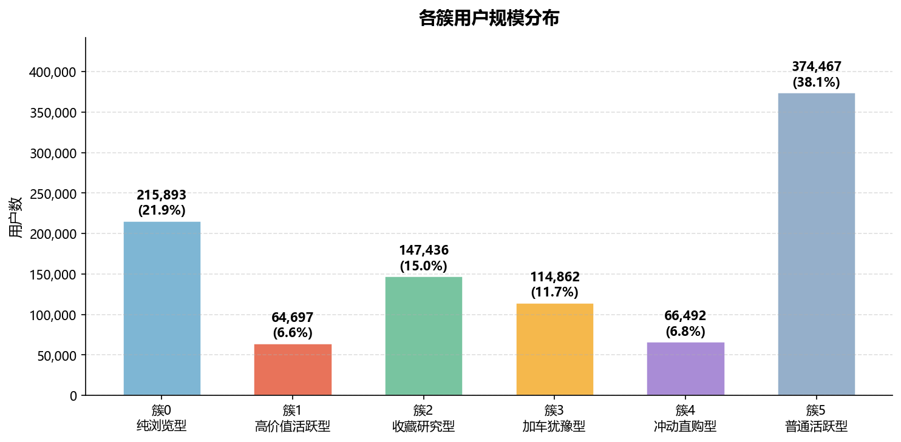
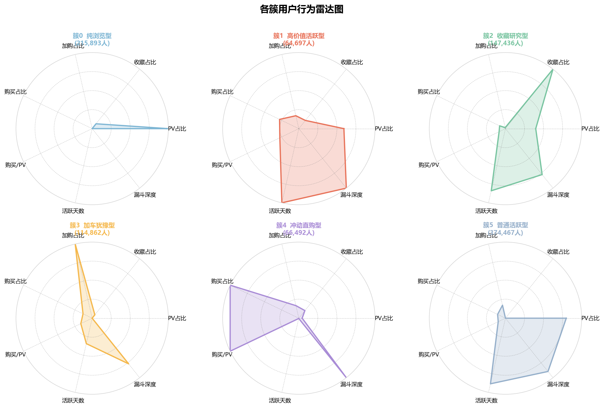
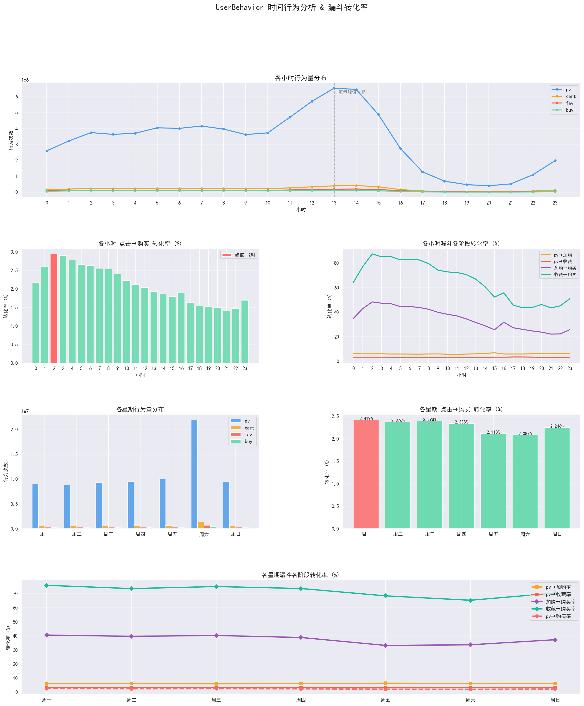
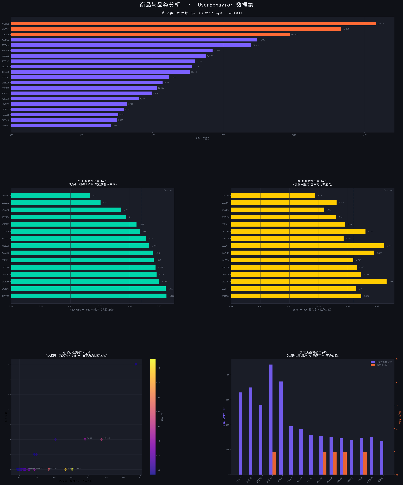
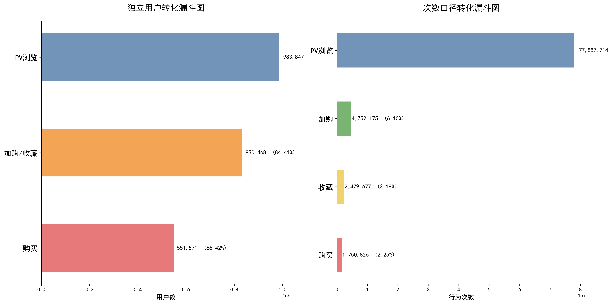

# 淘宝用户行为数据分析与推荐系统报告
# Taobao User Behavior Data Analysis and Recommendation System Report

---

## 一、项目概述 / Project Overview

### 1.1 研究背景与目标 / Research Background & Objectives

本项目基于淘宝用户行为数据，旨在通过数据挖掘技术深入分析用户行为模式，构建用户画像体系，并设计一套高效的电商推荐系统。通过对约8687万条用户行为记录的分析，实现以下目标：

This project analyzes Taobao user behavior data to achieve the following objectives:

| 目标 / Objective | 中文说明 / Chinese | English Description |
|----------------|-------------------|---------------------|
| 用户行为漏斗 / Funnel Analysis | 构建完整的用户行为漏斗分析体系 | Construct complete user behavior funnel analysis |
| 用户画像分群 / User Segmentation | 建立基于聚类的用户画像分群 | Establish clustering-based user portrait segmentation |
| 推荐系统 / Recommendation | 设计两阶段电商推荐系统（品类级→商品级） | Design two-stage recommendation (category→item) |
| 关联规则 / Association Rules | 挖掘品类间的关联规则 | Mine association rules between categories |
| 算法评估 / Algorithm Evaluation | 评估不同推荐算法的效果差异 | Evaluate different recommendation algorithms |

### 1.2 数据规模说明 / Data Scale

| 数据类型 / Data Type | 规模 / Scale |
|---------------------|--------------|
| 原始行为记录 / Raw Records | ~1亿条 / ~100M |
| 清洗后记录 / Cleaned Records | 86,870,392条 / 86.87M |
| 用户数 / Users | 983,847人 / 983.85K |
| 商品数 / Items | 137,918个 / 137.92K |
| 品类数 / Categories | 9,377 → 8,244 (过滤后 / After filtering) |
| 购买记录 / Purchase Records | 1,750,826条 / 1.75M |
| 用户-品类交互 / User-Category Interactions | 21,693,100条 / 21.69M |
| 矩阵密度 / Matrix Density | 0.27% |

**矩阵密度说明 / Matrix Density Note**: 矩阵密度是指用户-品类交互矩阵中非零元素的比例，反映了电商推荐系统的长尾特征——用户只与极少数品类产生交互。

Matrix density refers to the ratio of non-zero elements in the user-category interaction matrix, reflecting the long-tail characteristic of e-commerce systems.

### 1.3 数据来源与许可 / Data Source & License

| 项目 / Item | 内容 / Content |
|------------|----------------|
| **平台 / Platform** | 阿里云天池 Tianchi |
| **数据集 / Dataset** | User Behavior Data from Taobao |
| **链接 / Link** | https://tianchi.aliyun.com/dataset/dataDetail?dataId=649 |
| **时间范围 / Period** | 2017-11-25 至 2017-12-03 |
| **许可 / License** | 仅供学习研究，禁止商业用途 / Educational use only |

详细许可证信息请参阅 [DATA_LICENSE](DATA_LICENSE)。

For detailed license information, see [DATA_LICENSE](DATA_LICENSE).

### 1.4 技术路线与方法论 / Technical Roadmap & Methodology

#### 技术路线 / Technical Roadmap

```
数据预处理 (Data Preprocessing)
    ↓
用户画像构建 (User Portrait Construction)
    ↓
转化漏斗分析 (Funnel Analysis)
    ↓
时间行为分析 (Temporal Analysis)
    ↓
品类分析 (Category Analysis)
    ↓
推荐系统 (Recommendation System)
```

#### 方法论 / Methodology

| 阶段 / Stage | 方法 / Method | 说明 / Description |
|-------------|-------------|-------------------|
| 用户聚类 / User Clustering | KMeans | 基于18维特征的聚类分析，将用户分为6类 |
| 漏斗分析 / Funnel Analysis | 双口径分析 | 用户口径+次数口径双维度转化分析 |
| 时间分析 / Temporal Analysis | 描述性统计 | 小时和星期维度的时间行为分布 |
| 关联规则 / Association Rules | FP-Growth | 频繁项集挖掘，发现品类间关联 |
| 协同过滤 / Collaborative Filtering | ALS + User-CF | 矩阵分解和用户相似度的混合推荐 |

---

## 二、数据预处理 / Data Preprocessing

### 2.1 数据字典 / Data Dictionary

| 字段名 / Field | 类型 / Type | 说明 / Description |
|--------------|-----------|-------------------|
| user_id | int32 | 用户唯一标识 / Unique user identifier |
| item_id | int32 | 商品唯一标识 / Unique item identifier |
| category_id | int32 | 品类标识 / Category identifier |
| behavior_type | string | 行为类型: pv/cart/fav/buy |
| datetime | datetime | 行为时间戳 / Behavior timestamp |

**行为类型说明 / Behavior Type Description**:

| 行为类型 / Behavior | 中文说明 / Chinese | English Description |
|-------------------|-------------------|---------------------|
| pv | 页面浏览 | Page View |
| cart | 加入购物车 | Add to Cart |
| fav | 收藏商品 | Add to Favorites |
| buy | 购买商品 | Purchase |

### 2.2 数据清洗策略 / Data Cleaning Strategy

| 清洗步骤 / Step | 说明 / Description |
|----------------|-------------------|
| 时间范围过滤 / Date Range Filter | 仅保留 2017-11-25 至 2017-12-03 / Keep only 2017-11-25 to 2017-12-03 |
| PV次数过滤 / PV Count Filter | 1 < pv_count < 1000，剔除刷屏或低活跃用户 / Remove outliers |
| 低频品类过滤 / Low-frequency Filter | 过滤交互次数过少的品类 / Filter low-interaction categories |
| 行为类型 / Behavior Types | 保留四种完整行为类型 / Keep all four behavior types |

### 2.3 最终数据规模 / Final Data Scale

| 指标 / Metric | 数值 / Value |
|--------------|-------------|
| 行为记录 / Behavior Records | 86,870,392条 |
| 用户数 / Users | 983,847 |
| 商品数 / Items | 137,918 |
| 品类数 / Categories | 8,244 (过滤后) |
| 矩阵密度 / Matrix Density | 0.27% |

---

## 三、转化漏斗分析 / Conversion Funnel Analysis

### 3.1 用户口径漏斗分析 / User-Based Funnel Analysis

用户口径关注独立用户在各环节的转化情况。

```
┌────────────────────────────────────────────────────────────┐
│              用户口径转化漏斗 / User-Based Conversion      │
├────────────────────────────────────────────────────────────┤
│  浏览用户 / Browsing Users      983,847 (100%)            │
│           ↓ 转化率 84.41% / Conversion 84.41%             │
│  加购/收藏用户 / Cart+Fav       830,468 (84.41%)          │
│           ↓ 流失率 33.58% / Loss Rate 33.58%             │
│  购买用户 / Purchasing Users    551,571 (56.06%)          │
└────────────────────────────────────────────────────────────┘
```

#### 关键发现 / Key Findings

| 环节 / Stage | 用户数 / Users | 转化率 / Conversion | 流失率 / Loss Rate |
|-------------|---------------|-------------------|-------------------|
| 浏览→加购/收藏 / Browse→Cart+Fav | 830,468 | 84.41% | 15.59% |
| 加购/收藏→购买 / Cart+Fav→Buy | 551,571 | 66.42% | **33.58%** |

> **最大流失节点 / Maximum Loss Point**: 加购/收藏→购买（流失率33.58%）

### 3.2 次数口径漏斗分析 / Count-Based Funnel Analysis

```
┌────────────────────────────────────────────────────────────┐
│            次数口径转化漏斗 / Count-Based Conversion       │
├────────────────────────────────────────────────────────────┤
│  浏览次数 / PV Count77,887,714 (100%)          │
│           ↓ 转化率 9.28% / Conversion 9.28%              │
│  加购/收藏次数 / Cart+Fav      7,231,852 (9.28%)           │
│           ↓ 转化率 24.21% / Conversion 24.21%            │
│  购买次数 / Purchase Count    1,750,826 (2.25%)           │
└────────────────────────────────────────────────────────────┘
```

### 3.3 业务洞察 / Business Insights

| 发现 / Finding | 建议 / Recommendation |
|--------------|----------------------|
| 加购/收藏→购买是最大流失环节 / Cart/Fav→Buy is biggest loss | 转化激励（限时优惠、库存提醒）/ Incentives needed |
| 直接购买用户占比12% / 12% direct buyers | 快速结账通道 / Quick checkout |
| 收藏转化率低于加购 / Fav < Cart conversion | 收藏适合"研究型"用户 / Fav for research |

---

## 四、用户画像与聚类分析 / User Portrait & Clustering

### 4.1 特征工程 / Feature Engineering

| 特征类别 / Feature Type | 特征 / Features | 变换方法 / Transform |
|----------------------|----------------|-------------------|
| 频次特征 / Count | pv_count, fav_count, cart_count, buy_count | log1p变换 / log1p |
| 比例特征 / Ratio | pv_ratio, fav_ratio, cart_ratio, buy_ratio | 占比计算 / Ratio |
| 转化率 / Conversion | cart_per_pv, buy_per_cart, buy_per_pv | 比率计算 / Rate |
| 时间分布 / Time | morning_ratio, afternoon_ratio, evening_ratio, midnight_ratio | 时段统计 / Period |
| 漏斗深度 / Funnel | funnel_depth | 类型计数 / Type count |

### 4.2 聚类模型 / Clustering Model

| 参数 / Parameter | 值 / Value |
|----------------|-----------|
| 算法 / Algorithm | KMeans |
| 聚类数 / K | 6 |
| 标准化 / Scaling | StandardScaler |
| 确定方法 / Selection | 肘部法 + 轮廓系数 / Elbow + Silhouette |

### 4.3 聚类结果 / Clustering Results

| 簇ID / Cluster | 名称 / Name | 用户数 / Users | 占比 / Ratio | 核心特征 / Key Features |
|--------------|-------------|--------------|-------------|------------------------|
| 0 | 纯浏览型 / Pure Browsing | 215,893 | 21.9% | PV占比96%，转化极低 / PV 96%, minimal conversion |
| 1 | 高价值活跃型 / High-Value | 64,697 | 6.6% | 全环节活跃，转化最高 / Fully active, highest CVR |
| 2 | 收藏研究型 / Research | 147,436 | 15.0% | 收藏占比12% / Fav ratio 12% |
| 3 | 加车犹豫型 / Cart-Hesitant | 114,862 | 11.7% | 加购占比21% / Cart ratio 21% |
| 4 | 冲动直购型 / Impulse | 66,492 | 6.8% | 购买/PV转化率20% / Purchase/PV 20% |
| 5 | 普通活跃型 / Normal | 374,467 | 38.1% | 最大群体，均衡 / Largest, balanced |

### 4.4 用户画像详情 / User Portrait Details

#### 簇0：纯浏览型 / Pure Browsing

- **用户规模 / Users**: 215,893 (21.9%)
- **核心特征 / Features**: PV占比96.1%，购买占比0.4%，漏斗深度2.2
- **行为模式 / Pattern**: 浏览量大但转化极低，"只看不买"群体
- **运营策略 / Strategy**: 精准推荐、兴趣挖掘

#### 簇1：高价值活跃型 / High-Value Active

- **用户规模 / Users**: 64,697 (6.6%)
- **核心特征 / Features**: PV量116.6次/人，购买率4.9%，漏斗深度4.0
- **行为模式 / Pattern**: 全环节活跃，平台高价值用户
- **运营策略 / Strategy**: VIP维护，会员专属权益

#### 簇2：收藏研究型 / Research-Oriented

- **用户规模 / Users**: 147,436 (15.0%)
- **核心特征 / Features**: 收藏占比12.2%，购买占比1.8%
- **行为模式 / Pattern**: 收藏商品进行研究和对比
- **运营策略 / Strategy**: 降价提醒、同类对比工具

#### 簇3：加车犹豫型 / Cart-Hesitant

- **用户规模 / Users**: 114,862 (11.7%)
- **核心特征 / Features**: 加购占比20.9%，购买/加购转化率13.6%
- **行为模式 / Pattern**: 大量加购但转化偏低
- **运营策略 / Strategy**: 限时优惠、库存提醒

#### 簇4：冲动直购型 / Impulse Buyer

- **用户规模 / Users**: 66,492 (6.8%)
- **核心特征 / Features**: 购买占比16.5%，购买/PV转化率19.9%
- **行为模式 / Pattern**: 决策果断，冲动消费
- **运营策略 / Strategy**: 快速结账、一键购买

#### 簇5：普通活跃型 / Normal Active

- **用户规模 / Users**: 374,467 (38.1%)
- **核心特征 / Features**: PV占比91.9%，购买占比2.3%
- **行为模式 / Pattern**: 最大群体，行为均衡
- **运营策略 / Strategy**: 常规营销、活动推送

### 4.5 簇间特征对比 / Cluster Comparison






---

## 五、时间行为分析 / Temporal Behavior Analysis

### 5.1 小时维度分析 / Hourly Analysis

| 小时 / Hour | PV | 加购 / Cart | 收藏 / Fav | 购买 / Buy | 转化率 / CVR |
|-----------|-----|------------|-----------|-----------|-------------|
| 0 | 1,982,347 | 130,081 | 65,885 | 33,520 | 1.69% |
| 1 | 3,215,253 | 195,585 | 108,915 | 83,887 | 2.61% |
| **2** | **3,742,779** | **227,687** | **125,923** | **109,956** | **2.94%** |
| 3 | 3,632,239 | 222,620 | 123,878 | 105,238 | 2.90% |
| 4 | 3,700,413 | 219,875 | 120,990 | 102,964 | 2.78% |
| ... | ... | ... | ... | ... | ... |
| **13** | **6,532,084** | **398,471** | **188,424** | **125,953** | 1.93% |
| 14 | 6,455,465 | 416,429 | 198,500 | 120,403 | 1.87% |
| ... | ... | ... | ... | ... | ... |
| 20 | 403,752 | 25,324 | 13,000 | 6,015 | 1.49% |

#### 关键发现 / Key Findings

| 指标 / Metric | 峰值时间 / Peak | 数值 / Value |
|-------------|---------------|-------------|
| 流量最高 / Max Traffic | 13时 | 6,532,084次 |
| 购买最多 / Max Purchases | 13时 | 125,953次 |
| **转化率最高 / Max CVR** | **2时** | **2.94%** |
| 流量最低 / Min Traffic | 20时 | 403,752次 |

### 5.2 星期维度分析 / Weekly Analysis

| 星期 / Weekday | PV | 加购 / Cart | 收藏 / Fav | 购买 / Buy | 转化率 / CVR |
|--------------|-----|------------|-----------|-----------|-------------|
| 周一 / Monday | 8,966,429 | 535,257 | 286,012 | 216,922 | **2.42%** |
| 周二 / Tuesday | 8,849,193 | 530,047 | 285,845 | 210,214 | 2.38% |
| ... | ... | ... | ... | ... | ... |
| **周六 / Saturday** | **21,910,454** | **1,359,144** | **700,643** | **457,159** | 2.09% |
| 周日 / Sunday | 9,475,706 | 571,457 | 302,497 | 212,795 | 2.25% |



### 5.3 营销建议 / Marketing Recommendations

| 时段 / Period | 策略 / Strategy |
|-------------|----------------|
| 凌晨2-4时 / 02:00-04:00 | 高转化率商品投放 / High-CVR item ads |
| 13-14时 / 13:00-14:00 | 大促、秒杀 / Promotions, flash sales |
| 周六 / Saturday | 大型活动 / Major events |
| 周一 / Monday | 精准营销 / Targeted marketing |

---

## 六、品类转化率分析 / Category Conversion Rate

### 6.1 GMV驱动品类 / GMV-Driven Categories

| 品类ID | PV | 购买 | GMV代理分 | 转化率 |
|-------|----|----|----------|-------|
| 4756105 | 3,883,924 | 24,363 | 258,188 | 0.63% |
| 4145813 | 2,749,173 | 27,593 | 233,342 | 1.00% |
| 982926 | 2,428,560 | 21,601 | 197,030 | 0.89% |

**GMV集中度 / GMV Concentration**: Top10品类占全平台 12.6%

### 6.2 品类分类 / Category Classification

| 品类类型 / Type | 转化率范围 / CVR Range | 代表品类 / Examples |
|---------------|----------------------|-------------------|
| 高意愿品类 / High-Intent | >100% (合并口径) | 937407, 2812993 |
| 普通品类 / Normal | 10-50% | 1464116, 2885642 |
| 价格敏感品类 / Price-Sensitive | <10% | 4655941, 2352202 |



---

## 七、推荐系统设计 / Recommendation System Design

### 7.1 系统架构 / System Architecture

```
┌─────────────────────────────────────────────────────────────────┐
│                  推荐系统四步流水线 / Four-Step Pipeline          │
├─────────────────────────────────────────────────────────────────┤
│  Step 1: 数据预处理 → Step 2: 关联规则 → Step 3: 协同过滤      │
│  Data Prep → Association Rules → Collaborative Filtering       │
└─────────────────────────────────────────────────────────────────┘
                              ↓
┌─────────────────────────────────────────────────────────────────┐
│                  第四步 / Step 4: 两阶段推荐                    │
│                  Two-Stage Recommendation                      │
│  1. ALS推荐品类 → 2. 品类内按热度推荐商品                       │
│  1. ALS recommends categories → 2. Rank items by hotness      │
└─────────────────────────────────────────────────────────────────┘
```

### 7.2 方法论 / Methodology

#### 关联规则挖掘 / Association Rules Mining

| 参数 / Parameter | 值 / Value |
|----------------|-----------|
| 算法 / Algorithm | FP-Growth |
| min_support | 0.002 |
| Lift > 1 | 是 |
| Confidence ≥ 0.1 | 是 |

#### 协同过滤 / Collaborative Filtering

| 模型 / Model | 参数 / Parameters | 特点 / Characteristics |
|-------------|------------------|----------------------|
| User-CF | 簇内余弦相似度 | 适合簇内相似用户推荐 |
| ALS | factors=64, iter=20 | 矩阵分解，处理稀疏数据 |

### 7.3 模型评估 / Model Evaluation

#### 评估指标 / Metrics

| 指标 / Metric | 公式 / Formula | 含义 / Meaning |
|-------------|--------------|--------------|
| Precision@K | \|Rec ∩ GT\| / K | Top-K命中比例 / Hit ratio |
| Recall@K | \|Rec ∩ GT\| / \|GT\| | 召回比例 / Coverage |
| NDCG@K | DCG/IDCG | 排序质量 / Ranking quality |

#### 评估结果 @K=10 / Results @K=10

| 模型 / Model | Precision@10 | Recall@10 | NDCG@10 |
|-------------|-------------|----------|---------|
| 热门基准 / Popular | 1.03% | 10.31% | 0.0518 |
| User-CF | 1.30% | 13.04% | 0.0737 |
| **ALS** | **1.97%** | **19.68%** | **0.0912** |



---

## 八、综合结论与建议 / Conclusions & Recommendations

### 8.1 核心发现 / Key Findings

| 维度 / Dimension | 发现 / Finding |
|---------------|--------------|
| 漏斗转化 / Funnel | 加购/收藏→购买流失率33.58% |
| 用户分群 / Segmentation | 6类用户，高价值型仅占6.6% |
| 时间规律 / Temporal | 流量峰值周六13时，转化率峰值凌晨2时 |
| 推荐系统 / Recommendation | ALS表现最优，Precision@10达1.97% |

### 8.2 分人群运营策略 / User-Specific Strategies

| 用户类型 / User Type | 占比 / Ratio | 策略 / Strategy |
|--------------------|-------------|-----------------|
| 高价值活跃型 / High-Value | 6.6% | VIP维护 / VIP maintenance |
| 冲动直购型 / Impulse | 6.8% | 快速结账 / Quick checkout |
| 加车犹豫型 / Cart-Hesitant | 11.7% | 加购激励 / Cart incentives |
| 收藏研究型 / Research | 15.0% | 降价提醒 / Price alerts |
| 纯浏览型 / Pure Browsing | 21.9% | 精准推荐 / Precision rec |
| 普通活跃型 / Normal | 38.1% | 常规营销 / Regular marketing |

---

## 九、附录 / Appendix

### 9.1 数据字典 / Data Dictionary

| 字段 / Field | 类型 / Type | 说明 / Description | 示例 / Example |
|-------------|-----------|-------------------|---------------|
| user_id | int32 | 用户ID | 123456789 |
| item_id | int32 | 商品ID | 987654321 |
| category_id | int32 | 品类ID | 12345 |
| behavior_type | string | 行为类型 | pv/cart/fav/buy |
| datetime | datetime | 行为时间 | 2017-11-25 10:30:00 |

**行为类型 / Behavior Types**:

| 类型 / Type | 中文 | 英文 |
|------------|-----|------|
| pv | 页面浏览 | Page View |
| cart | 加购物车 | Add to Cart |
| fav | 收藏 | Add to Favorites |
| buy | 购买 | Purchase |

### 9.2 可视化图表 / Visualizations

| 图表 / Chart | 文件 / File | 说明 / Description |
|-------------|-------------|-------------------|
| 用户特征热力图 | cluster_heatmap.png | 6类用户18维特征对比 |
| 用户行为雷达图 | cluster_radar.png | 各簇行为模式 |
| 用户规模分布 | cluster_distribution.png | 用户数量占比 |
| 转化漏斗图 | conversion_funnel.png | 双口径漏斗转化 |
| 时间行为图 | time_behavior_analysis.png | 时间维度分布 |
| 品类分析图 | product_category_analysis.png | 品类GMV与转化率 |

### 9.3 关键代码 / Key Code

```python
# 特征工程
df['pv_count_log'] = np.log1p(df['pv_count'])
df['pv_ratio'] = df['pv_count'] / df['total_count']

# ALS模型
from implicit.als import AlternatingLeastSquares
model = AlternatingLeastSquares(factors=64, iterations=20)
model.fit(confidence_matrix)
```

---

## 十、局限性说明 / Limitations

### 10.1 数据局限 / Data Limitations

| 局限性 / Limitation | 说明 / Description | 影响 / Impact |
|-------------------|-------------------|--------------|
| 时间范围有限 / Limited Period | 仅9天数据 (2017-11-25至2017-12-03) | 无法分析长期趋势 |
| 双十二影响 / Promotion Effect | 涵盖双十二预热期 | 用户行为可能受促销影响 |
| 数据脱敏 / Anonymization | 原始数据已脱敏 | 无法分析价格、品牌等因素 |
| 品类粒度 / Category Granularity | 基于品类级别分析 | 商品级别推荐效果未知 |

### 10.2 方法局限 / Method Limitations

| 局限性 / Limitation | 说明 / Description | 改进建议 / Improvement |
|-------------------|-------------------|----------------------|
| 冷启动 / Cold Start | 新用户无历史数据 | 可结合内容推荐 |
| 矩阵稀疏 / Sparsity | 0.27%密度 | 可尝试图神经网络 |
| 仅购买评估 / Purchase Only | 仅用购买作为ground truth | 可加入加购、收藏等信号 |
| 离线评估 / Offline Only | 未做A/B测试 | 建议线上验证 |

### 10.3 结论外推注意事项 / Conclusion Caveats

1. **时效性**：数据来自2017年，电商环境已发生较大变化
2. **平台差异**：分析基于淘宝数据，其他平台可能不适用
3. **样本偏差**：数据为公开数据集，可能存在采样偏差
4. **结论验证**：建议通过A/B测试验证业务建议的有效性

---

## 结语 / Conclusion

本报告通过对淘宝用户行为数据的深度分析，构建了完整的用户画像体系、转化漏斗分析模型和两阶段推荐系统。

**主要成果 / Key Achievements**:

1. 识别出6类用户画像，其中高价值活跃型和冲动直购型是重点运营对象
   Identified 6 user types with high-value and impulse buyers as priority

2. 发现加购/收藏→购买是最大流失节点（33.58%），存在巨大优化空间
   Discovered Cart/Fav→Buy is maximum loss point (33.58%)

3. 构建的ALS推荐系统Precision@10达到1.97%，显著优于基线方法
   ALS achieves 1.97% Precision@10, significantly better than baseline

4. 两阶段推荐策略有效解决了Item级数据稀疏问题
   Two-stage strategy solves item-level sparsity

---

| 项目 / Item | 内容 / Content |
|------------|----------------|
| **报告生成时间 / Generated** | 2026年3月27日 |
| **数据时间范围 / Data Period** | 2017-11-25 至 2017-12-03 |
| **数据来源 / Data Source** | 阿里云天池 Tianchi |
| **数据链接 / Data Link** | https://tianchi.aliyun.com/dataset/dataDetail?dataId=649 |
| **代码许可 / Code License** | MIT (见 LICENSE) |
| **数据许可 / Data License** | Tianchi Terms (见 DATA_LICENSE) |
| **报告版本 / Version** | v2.0 |
